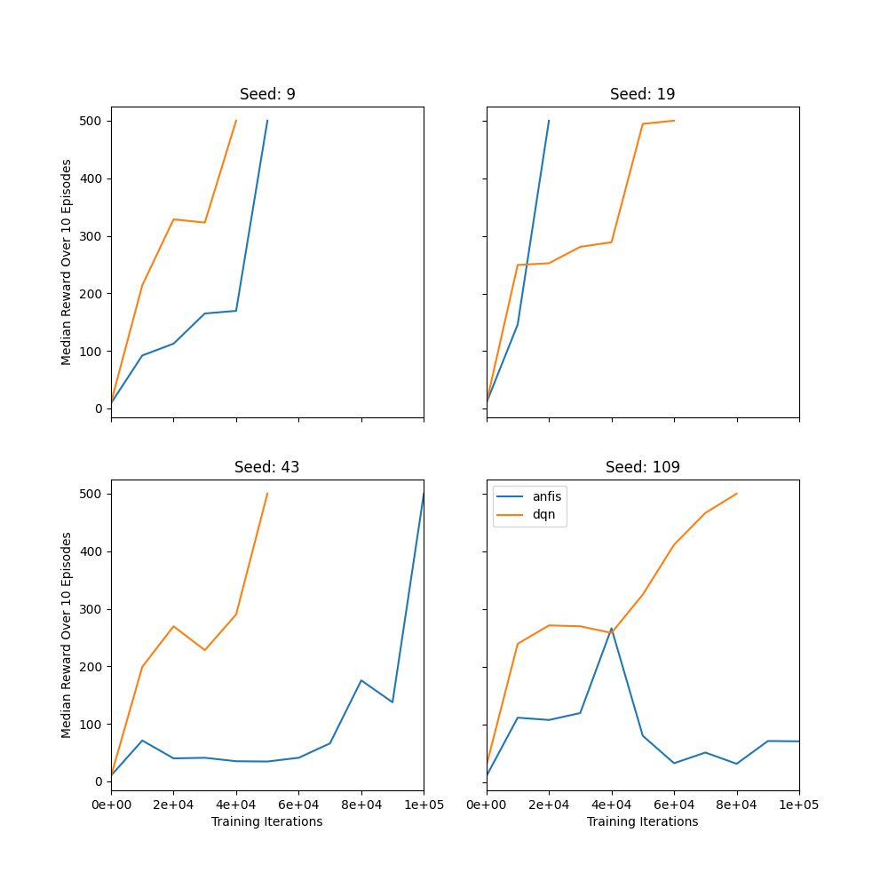

# anfis-rl
This is a repository for working with an ANFIS and reinforcement learning.

To run examples, do ```python main.py``` and then pass the desired arguments.

For the reproducible examples already done:
dqn layers = [153, 153]

anfis layers = [145, 147]
anfis rules = 16


